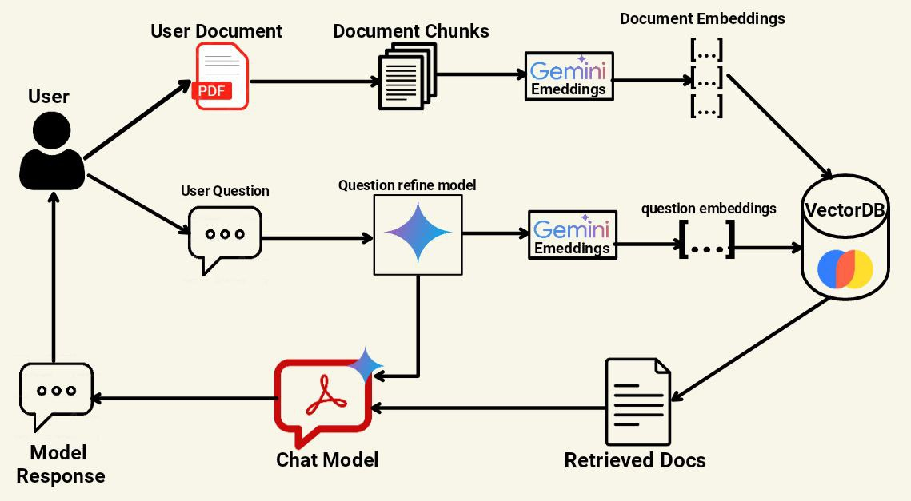

<h1>

Gemini PDF chatbot
</h1>

## Project description
With the recent hype around Large Language model, I wanted to gain a better understanding of how they worked. As such I decided to create a custom knowledge chatbot which allows users to interact with their own PDF documents. The chatbot utilizes the **Retrieval-Augmented Generation (RAG)** technique in conjunction with the Gemini API to enable seamless interaction with user documents. Users simply upload their files, it is then processed and vectorized using Gemini embeddings and stored in a vectorDB. when a user asks a question   

## Tech Stack
* Gemini API: Gemini model was used for both the question refiner and the user chat mode. Gemini embeddings were also used for the vectorDB
* Python (Flask): Backend development and model
* HTML, CSS, JS: front end development
* Langchain: model development tools
* ChromaDB: Vector Database.

## System Architecture
The Chatbot system utilizes the RAG technique and its architecture can be broken down into three different parts: Document processing, Document retrieval, and model response. When the user uploads his document, it is split into chunks of each individual page, and then using Gemini embeddings the pages are converted into vector embeddings which are stored in a ChromaDB vector Database. When the user asks their question, it goes through a question refine model where if the question is a standalone question, it remains as is, but if it is a follow up question, the question is modified so that it can be used as a standalone question. Once this is done the question is then turned into vector embedding and a semantic search of the vectorDB is done to find the most relevant pages to the user question. Finally for the model response, the modified question, along with the content of the relevant documents are given to the Gemini model and it will return an answer based on the retrieved pages. 

